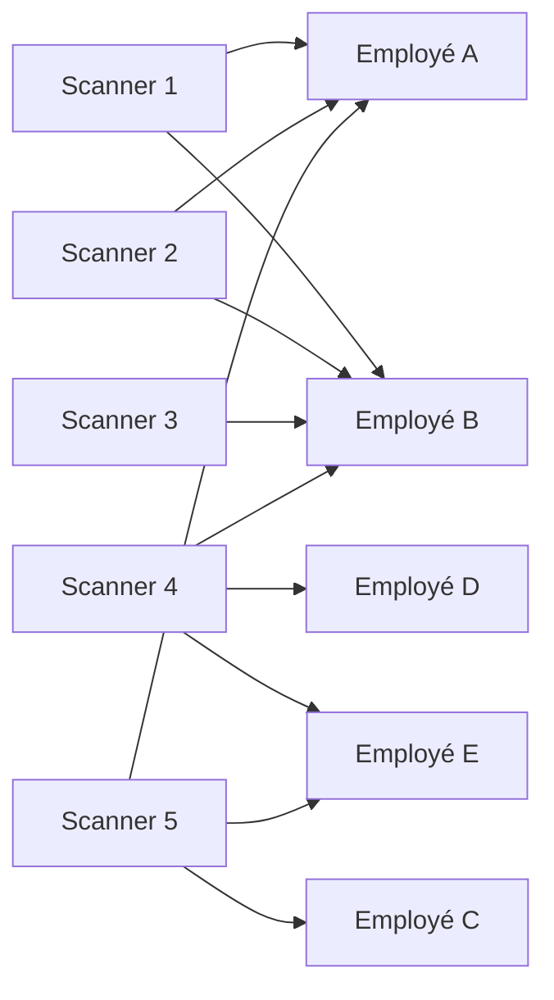
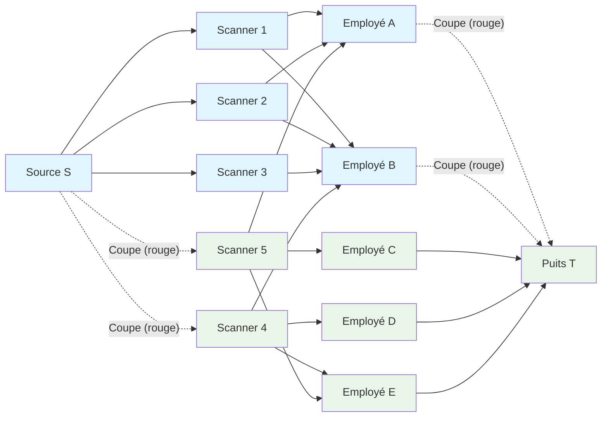

# Lab Max Flow - Optimisation de Scanners Hospitaliers

Un hôpital possède 5 scanners différents et 5 employés. Seulement, tous les employés ne savent pas utiliser tous les scanners.
Les scanners sont numérotés de 1 à 5 et les employés de A à E. Les employés sachant utiliser chaque scanner sont
représentés par le diagramme suivant :

*Une flèche de scanner i vers employé j représente que j sait utiliser le scanner i.*

## Questions

### Question 1
En supposant que les 5 employés sont disponibles. Combien de scans peuvent être effectués en même temps ?

Solution

Les scanners 1, 2, 3 ne peuvent qu'être utilisés par A et B donc on ne sait pas utiliser ces 3 scanners en même temps.
On ne sait donc utiliser que 4 scanners à la fois.

### Question 2
Proposer une formation à l'utilisation d'un scan pour un employé qui augmenterait le nombre de scans pouvant être effectués simultanément.

Solution

Il faut former C, D ou E à l'utilisation d'un des scanners 1, 2 ou 3.

Suite à l'apparition d'une pandémie, l'état a investi massivement dans l'hôpital.
Il y a maintenant 100 scanners et 100 employés pouvant effectuer les scans.

### Question 3
Quel algorithme pouvez-vous utiliser pour résoudre ce problème efficacement ? (*Indice: il faut peut-être ajouter des nœuds fictifs au graphe ci-dessus pour que ça corresponde à un des problèmes vu en cours...*)

### Question 4
Comment trouver quelle formation proposer pour augmenter la capacité de scan de l'hôpital à partir de la solution du problème ?

Solution

On ajoute une source qui relie à tous les scanners et on relie tous les employés à une source.
Ça donne un problème de Max-Flow avec une capacité de 1 pour toutes les arêtes.

De façon équivalente, le Max-Flow est égal à Min-Cut. La solution du Min-Cut est de grouper les nœuds
bleus et verts comme ci-dessous.
La coupe est alors formée par les arêtes en rouge qui relient un nœud bleu
à un nœud vert.

Il faut former un employé dont la solution du Max-Flow donne une valeur de 0
à son arête vers T à utiliser un scanner dont la solution du Max-Flow donne
une valeur de 0 à l'arête le reliant à S.

